# Blissful Infra Agent - Technical Specification

## Overview

Local LLM-powered agent that correlates multiple data sources to identify root causes, learn from incidents, and suggest infrastructure improvements. Runs entirely on local infrastructure via Ollama - zero external API costs.

## Goals

- Reduce mean time to root cause (MTTR) from hours to seconds
- Eliminate manual log correlation across systems
- Build institutional knowledge that persists across team changes
- Continuously improve infrastructure based on learned patterns
- Keep all data and processing local for cost and privacy

## Architecture
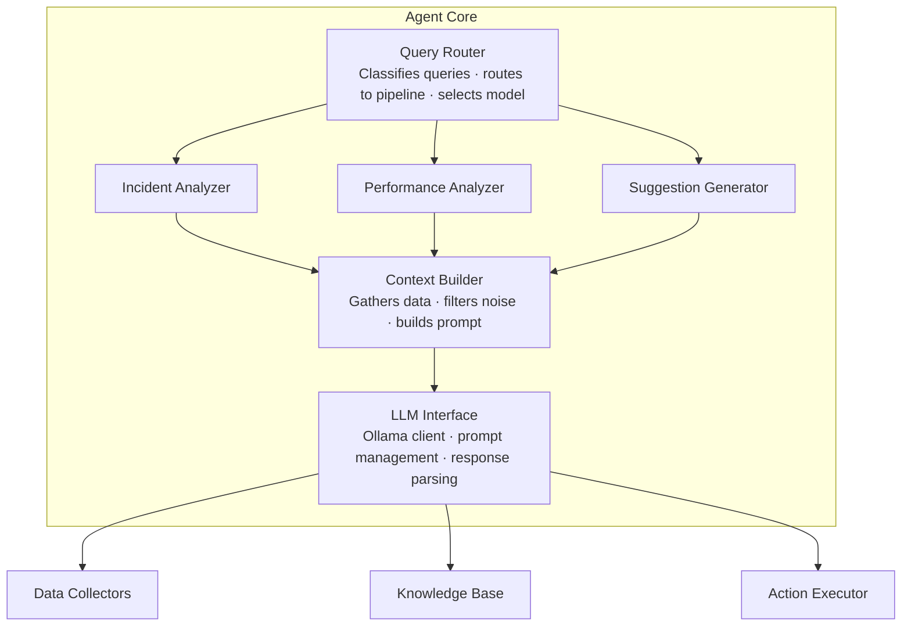

## Components

### 1. LLM Interface

#### Ollama Integration
```yaml
# agent-config.yaml
llm:
  provider: ollama
  endpoint: http://localhost:11434
  
  models:
    analysis:
      name: llama3.1:70b
      context_window: 32000
      temperature: 0.1
      purpose: deep analysis, root cause, code review
      
    quick:
      name: llama3.1:8b
      context_window: 8000
      temperature: 0.1
      purpose: simple queries, status checks, summaries
      
    embedding:
      name: nomic-embed-text
      dimensions: 768
      purpose: similarity search, pattern matching
      
    code:
      name: deepseek-coder:33b
      context_window: 16000
      temperature: 0.0
      purpose: code generation, fix suggestions

  selection_rules:
    - query_type: root_cause_analysis
      model: analysis
      
    - query_type: status_check
      model: quick
      
    - query_type: code_fix
      model: code
      
    - query_type: pattern_search
      model: embedding
```

#### Model Selection Logic
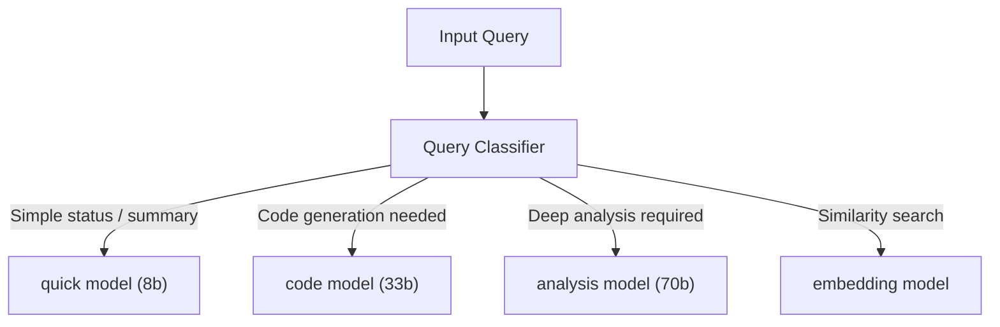

#### Resource Requirements

| Model | VRAM Required | Response Time | Use Case |
|-------|---------------|---------------|----------|
| llama3.1:8b | 8GB | 1-3s | Quick queries, summaries |
| llama3.1:70b | 48GB | 10-30s | Deep analysis |
| deepseek-coder:33b | 24GB | 5-15s | Code generation |
| nomic-embed-text | 2GB | <1s | Embeddings |

#### Fallback Strategy
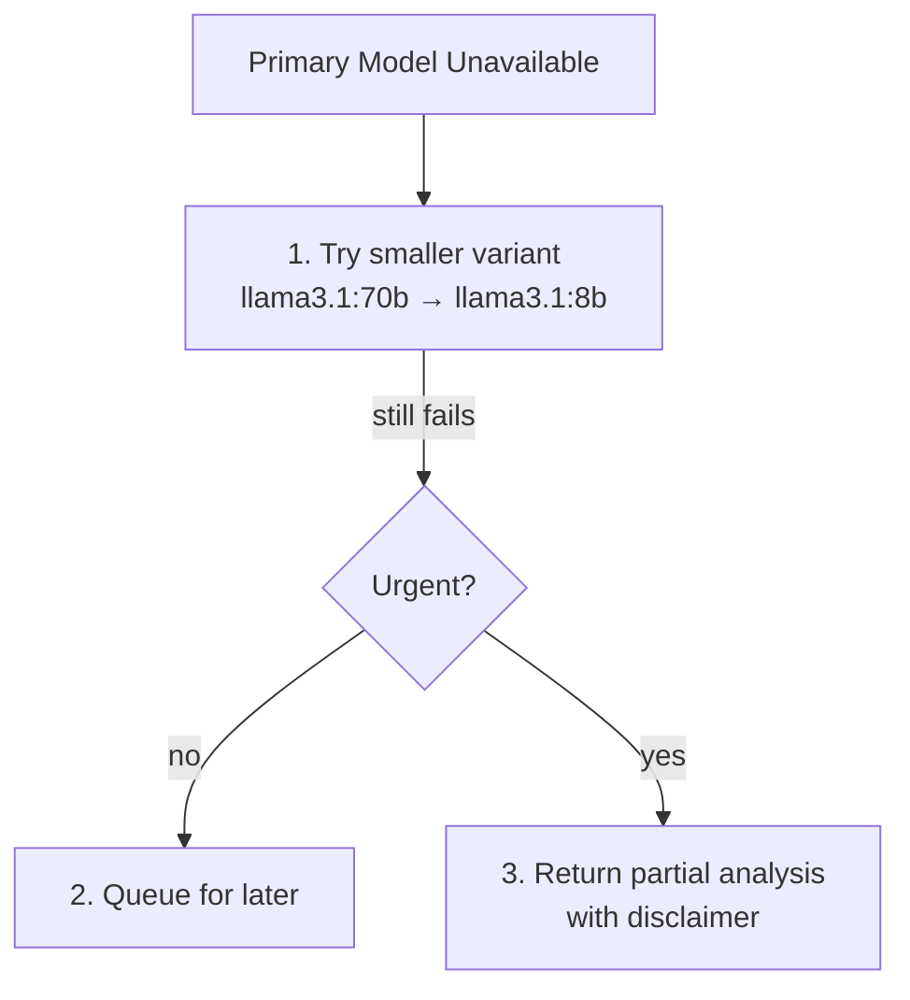

### 2. Data Collectors

#### Collector Interface
```typescript
interface DataCollector {
  name: string;
  source: DataSource;
  
  // Collect data for a time range
  collect(query: CollectorQuery): Promise<CollectedData>;
  
  // Check if collector is healthy
  healthCheck(): Promise<boolean>;
  
  // Get schema for LLM context
  getSchema(): DataSchema;
}

interface CollectorQuery {
  timeRange: TimeRange;
  filters?: Record<string, string>;
  limit?: number;
  includeContext?: boolean;
}

interface CollectedData {
  source: DataSource;
  timestamp: Date;
  data: any;
  relevanceScore?: number;
  summary?: string;
}
```

#### Available Collectors

**Git Collector**
```yaml
collector: git
source: local repository
data_collected:
  - commits in time range
  - diffs for changed files
  - blame for specific lines
  - branch/merge history
queries:
  - commits_between(start_sha, end_sha)
  - diff(sha)
  - blame(file, line_range)
  - files_changed(sha)
```

**Jenkins Collector**
```yaml
collector: jenkins
source: Jenkins API
data_collected:
  - build logs
  - test results (JUnit XML)
  - build duration and status
  - artifact metadata
queries:
  - build_log(job, build_number)
  - test_results(job, build_number)
  - recent_builds(job, limit)
  - failed_stages(job, build_number)
```

**Prometheus Collector**
```yaml
collector: prometheus
source: Prometheus API
data_collected:
  - time series metrics
  - alert history
  - recording rules
queries:
  - query_range(promql, start, end, step)
  - instant_query(promql)
  - alerts(time_range)
  - targets()
```

**Loki Collector**
```yaml
collector: loki
source: Loki API
data_collected:
  - application logs
  - structured log fields
  - log patterns
queries:
  - query_range(logql, start, end, limit)
  - label_values(label)
  - series(match)
```

**Kubernetes Collector**
```yaml
collector: kubernetes
source: Kubernetes API
data_collected:
  - pod status and events
  - deployment history
  - resource usage
  - config maps and secrets (names only)
queries:
  - pod_events(namespace, pod)
  - deployment_history(namespace, deployment)
  - resource_usage(namespace, pod)
  - describe(resource_type, name)
```

**Argo CD Collector**
```yaml
collector: argocd
source: Argo CD API
data_collected:
  - application sync status
  - deployment history
  - health status
  - resource tree
queries:
  - app_status(app_name)
  - sync_history(app_name, limit)
  - resource_tree(app_name)
  - diff(app_name)
```

**Chaos Mesh Collector**
```yaml
collector: chaos-mesh
source: Chaos Mesh API
data_collected:
  - experiment results
  - failure injection timeline
  - recovery metrics
queries:
  - experiment_results(name)
  - active_experiments()
  - experiment_history(limit)
```

**k6 Collector**
```yaml
collector: k6
source: k6 output files / InfluxDB
data_collected:
  - performance test results
  - threshold pass/fail
  - percentile metrics
queries:
  - test_results(test_run_id)
  - compare_runs(run_id_1, run_id_2)
  - threshold_status(test_run_id)
```

### 3. Context Builder

#### Context Assembly Pipeline
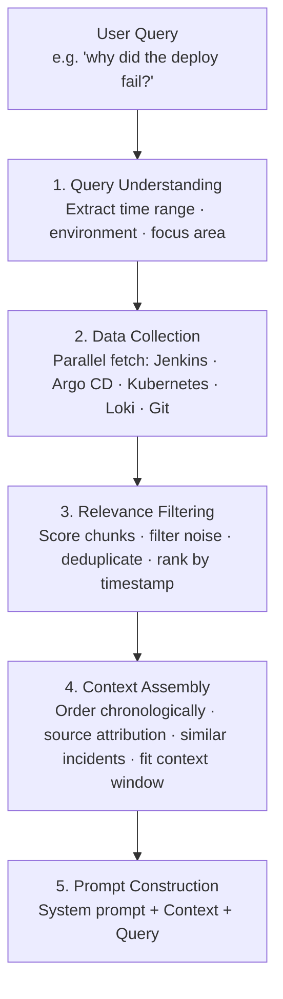

#### Relevance Scoring
```typescript
interface RelevanceScorer {
  // Score based on temporal proximity to incident
  temporalScore(dataTimestamp: Date, incidentTimestamp: Date): number;
  
  // Score based on semantic similarity to query
  semanticScore(data: string, query: string): number;
  
  // Score based on error/warning indicators
  severityScore(data: string): number;
  
  // Combined weighted score
  combinedScore(data: CollectedData, query: AnalysisQuery): number;
}

const scoringWeights = {
  temporal: 0.3,
  semantic: 0.4,
  severity: 0.3
};
```

#### Context Window Management
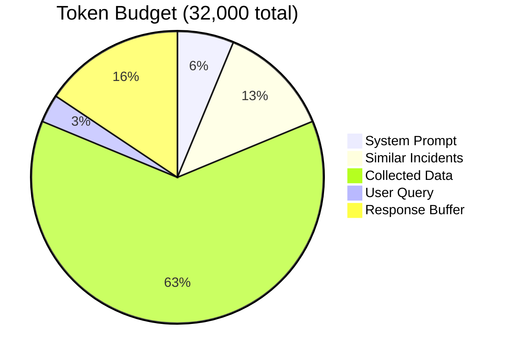

If data exceeds the collected data budget: summarize low-priority chunks → truncate verbose logs → keep full context for errors → reference rather than include.

### 4. Knowledge Base

#### Storage Schema
```yaml
knowledge_base:
  storage: sqlite  # or postgresql for teams
  path: .blissful-infra/knowledge/agent.db
  
  tables:
    incidents:
      - id: uuid
      - timestamp: datetime
      - environment: string
      - type: enum(deploy_failure, performance, chaos_test, etc)
      - summary: text
      - root_cause: text
      - resolution: text
      - resolution_successful: boolean
      - time_to_resolve_seconds: integer
      - related_commits: json
      - embedding: vector(768)
      
    patterns:
      - id: uuid
      - pattern_type: enum(error, performance, resource, etc)
      - signature: text  # normalized pattern
      - occurrences: integer
      - first_seen: datetime
      - last_seen: datetime
      - suggested_fix: text
      - fix_success_rate: float
      - embedding: vector(768)
      
    fixes:
      - id: uuid
      - incident_id: uuid (FK)
      - pattern_id: uuid (FK)
      - fix_type: enum(code, config, infra, manual)
      - fix_description: text
      - fix_diff: text
      - applied_at: datetime
      - outcome: enum(resolved, partial, failed)
      - notes: text
      
    suggestions:
      - id: uuid
      - type: enum(resilience, performance, security, cost)
      - priority: enum(high, medium, low)
      - title: text
      - description: text
      - evidence: json  # supporting data
      - suggested_fix: text
      - status: enum(pending, accepted, rejected, implemented)
      - created_at: datetime
      - embedding: vector(768)
```

#### Embedding Pipeline
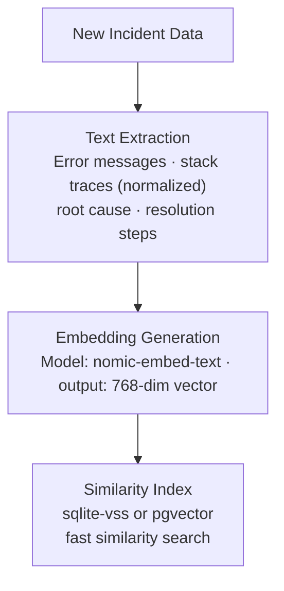

#### Pattern Recognition
```typescript
interface PatternRecognizer {
  // Extract normalized pattern from error
  extractPattern(error: string): Pattern;
  
  // Find similar patterns in knowledge base
  findSimilar(pattern: Pattern, threshold: number): SimilarPattern[];
  
  // Update pattern statistics
  recordOccurrence(patternId: string, incidentId: string): void;
  
  // Get suggested fix for pattern
  getSuggestedFix(patternId: string): Fix | null;
}

// Pattern normalization examples:
// "Connection refused to localhost:8080" 
//   → "Connection refused to {host}:{port}"
//
// "OOMKilled in pod my-service-abc123"
//   → "OOMKilled in pod {service}-{pod_id}"
//
// "NullPointerException at UserService.java:47"
//   → "NullPointerException at {class}:{line}"
```

#### Learning Loop
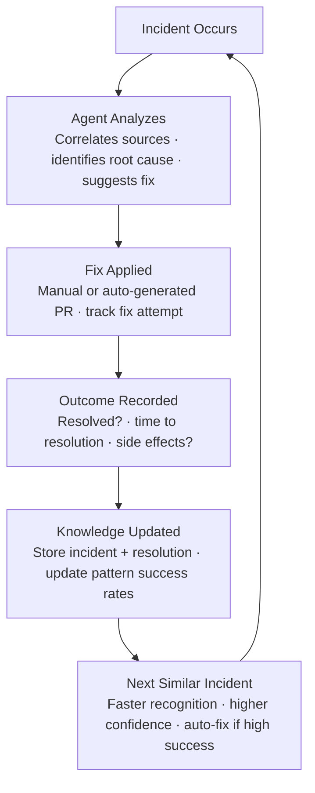

### 5. Analysis Pipelines

#### Root Cause Analysis Pipeline
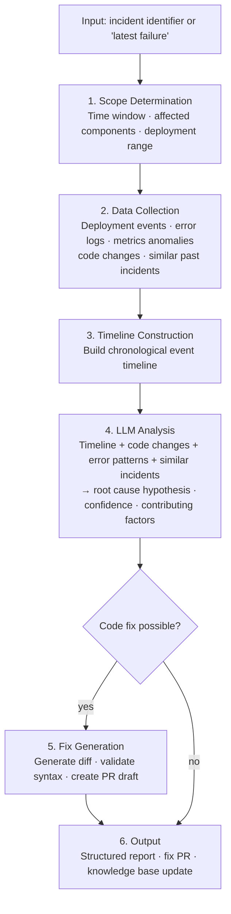

#### Performance Analysis Pipeline
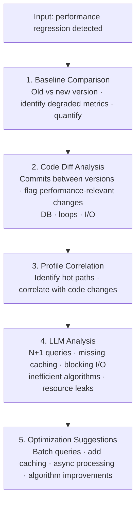

#### Suggestion Generation Pipeline
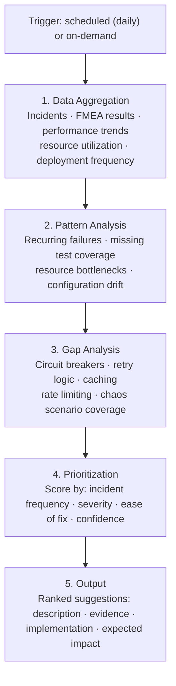

### 6. Action Executor

#### Supported Actions
```yaml
actions:
  create_pr:
    description: Create a pull request with suggested fix
    inputs:
      - branch_name
      - title
      - description
      - file_changes
    requires_approval: false
    
  rollback:
    description: Rollback to previous deployment
    inputs:
      - environment
      - target_revision
    requires_approval: true
    
  create_ticket:
    description: Create issue in tracking system
    inputs:
      - title
      - description
      - priority
      - labels
    requires_approval: false
    
  run_test:
    description: Trigger specific test suite
    inputs:
      - test_type
      - environment
    requires_approval: false
    
  update_config:
    description: Update configuration value
    inputs:
      - config_path
      - key
      - value
    requires_approval: true
    
  add_chaos_scenario:
    description: Add new FMEA test scenario
    inputs:
      - scenario_name
      - scenario_config
    requires_approval: false
```

#### Approval Flow
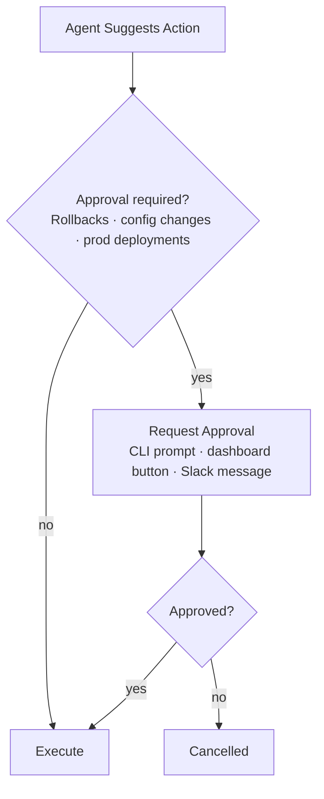

## Interfaces

### CLI Interface
```
$ blissful-infra agent

🤖 Easy Infra Agent (llama3.1:70b via Ollama)
   Knowledge base: 47 incidents, 23 patterns
   Type 'help' for commands, 'exit' to quit

> analyze last failure

Analyzing most recent failure...
[Collecting: jenkins ✓ argocd ✓ k8s ✓ loki ✓ git ✓]

... (analysis output)

> why

Expanding on root cause...

The OOMKilled event occurred because...

> suggest fix

Generating fix...

I can create a PR with the following changes:
- GreetingService.kt: Add bounded cache

Create PR? [y/N] y

Created PR #143: fix/bounded-cache
https://github.com/you/my-service/pull/143

> /similar

Finding similar past incidents...

Found 2 similar incidents:
1. [2024-01-10] OOM in UserService - resolved by adding cache eviction
2. [2023-12-15] Memory leak in OrderService - resolved by fixing unbounded list

> exit
```

### API Interface
```typescript
interface AgentAPI {
  // Analyze an incident
  analyze(query: AnalysisQuery): Promise<AnalysisResult>;
  
  // Get improvement suggestions
  suggest(options?: SuggestOptions): Promise<Suggestion[]>;
  
  // Interactive chat
  chat(message: string, context?: ChatContext): Promise<ChatResponse>;
  
  // Execute an action
  execute(action: AgentAction): Promise<ActionResult>;
  
  // Get knowledge base stats
  stats(): Promise<KnowledgeStats>;
}

interface AnalysisQuery {
  type: 'incident' | 'performance' | 'comparison';
  target?: string;  // incident ID, deploy ID, etc
  timeRange?: TimeRange;
  focus?: string[];  // specific areas to analyze
}

interface AnalysisResult {
  summary: string;
  rootCause: RootCause;
  confidence: number;
  timeline: TimelineEvent[];
  contributingFactors: string[];
  suggestedFixes: Fix[];
  similarIncidents: Incident[];
}
```

### Dashboard Integration
```typescript
// Dashboard WebSocket events
interface AgentEvents {
  // Analysis progress updates
  'analysis:started': { queryId: string };
  'analysis:collecting': { source: string; status: 'pending' | 'done' | 'error' };
  'analysis:complete': { queryId: string; result: AnalysisResult };
  
  // Suggestion updates
  'suggestion:new': { suggestion: Suggestion };
  'suggestion:updated': { id: string; status: string };
  
  // Action events
  'action:pending': { action: AgentAction };
  'action:approved': { actionId: string };
  'action:executed': { actionId: string; result: ActionResult };
}
```

## Configuration

### Full Configuration Schema
```yaml
# blissful-infra.yaml
agent:
  enabled: true
  
  # LLM Configuration
  llm:
    provider: ollama
    endpoint: http://localhost:11434
    models:
      analysis: llama3.1:70b
      quick: llama3.1:8b
      code: deepseek-coder:33b
      embedding: nomic-embed-text
    timeout_seconds: 120
    retry_attempts: 3
    
  # Knowledge Base
  knowledge_base:
    path: .blissful-infra/knowledge
    retention_days: 90
    index_on_deploy: true
    similarity_threshold: 0.75
    
  # Data Collectors
  collectors:
    git:
      enabled: true
      include_diffs: true
      max_diff_size_kb: 100
      
    jenkins:
      enabled: true
      url: http://jenkins:8080
      credentials_id: jenkins-api
      
    prometheus:
      enabled: true
      url: http://prometheus:9090
      
    loki:
      enabled: true
      url: http://loki:3100
      
    kubernetes:
      enabled: true
      # uses in-cluster config or KUBECONFIG
      
    argocd:
      enabled: true
      url: http://argocd-server:443
      
    chaos_mesh:
      enabled: true
      url: http://chaos-dashboard:2333
      
  # Analysis Settings
  analysis:
    default_time_window_minutes: 30
    max_log_entries: 1000
    max_metrics_points: 500
    include_similar_incidents: true
    max_similar_incidents: 5
    
  # Suggestions
  suggestions:
    enabled: true
    schedule: "0 9 * * *"  # daily at 9am
    min_incidents_for_pattern: 2
    auto_create_tickets: false
    
  # Actions
  actions:
    auto_rollback:
      enabled: false
      error_rate_threshold: 10
      requires_approval: true
    auto_pr:
      enabled: true
      requires_approval: false
    auto_ticket:
      enabled: true
      system: jira  # or github, linear
```

## Non-Functional Requirements

| Requirement | Target |
|-------------|--------|
| Analysis response time (simple) | < 5 seconds |
| Analysis response time (complex) | < 30 seconds |
| Embedding generation | < 1 second |
| Knowledge base query | < 100ms |
| Context building | < 3 seconds |
| Minimum accuracy (root cause) | 80% |
| False positive rate (suggestions) | < 20% |
| Local storage footprint | < 1GB |
| Memory usage (agent service) | < 2GB |

## Security Considerations

- All data stays local - no external API calls
- Knowledge base contains summarized data, not raw secrets
- Credentials accessed via existing secret management
- Audit log of all agent actions
- Role-based access for destructive actions
- Sensitive data filtering before LLM context