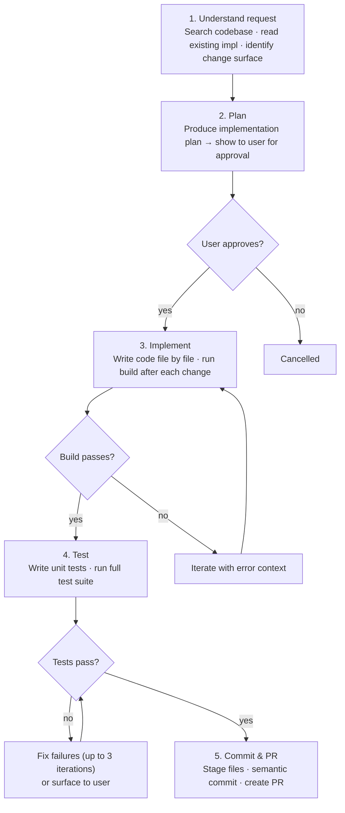
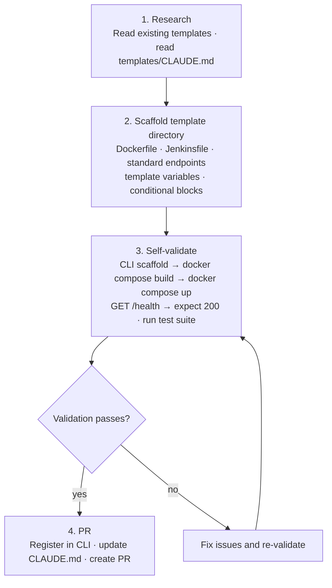
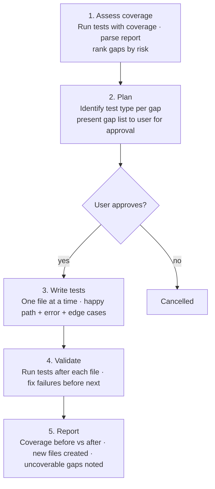

# Agentic Development Workflows

## Overview

Agentic workflows are the Phase 7 evolution of blissful-infra: purpose-built AI agents that participate in the software development lifecycle as first-class collaborators. Rather than a single general-purpose assistant, the system decomposes development work into specialized agents — each with a narrow focus, a defined tool set, and a clear output contract.

These agents operate at two levels:

- **Meta-level** — agents that build and improve blissful-infra itself (generating new templates, writing tests, monitoring the platform)
- **User-level** — agents embedded in user projects that accelerate their application development workflows

Both levels share the same agent architecture and tool protocol (MCP). A user running `blissful-infra agent:feature` gets the same quality of agent work that drives platform development internally.

---

## Design Principles

**Narrow scope, clear contracts.** Each agent does one thing well and produces a typed output (a PR, a test report, a research document, a template directory). Agents that try to do everything produce outputs that are hard to review and validate.

**Human in the loop by default.** Agents propose — humans approve. Agents should produce reviewable artifacts (PRs, diffs, reports) rather than making irreversible changes autonomously. The exception is the Monitor agent, which acts autonomously on well-defined runbooks.

**Sandbox-first.** All agent work happens in the local blissful-infra sandbox before touching any shared environment. An agent that breaks a unit test never gets to push.

**Composable pipelines.** Agents can be chained: the Research agent feeds findings to the Feature agent, which triggers the Test agent, whose report gates the PR. The orchestration layer (LangGraph or equivalent) wires these pipelines together.

**Observable.** Every agent action — tool calls, LLM completions, decisions — is logged and visible in the dashboard under an "Agent Activity" tab. This is both a debugging aid and a trust-building mechanism.

---

## Agent Catalog

### 1. Feature Development Agent

**Purpose:** Translates a natural-language feature request or issue description into working, tested, committed code.

**Trigger:** `blissful-infra agent:feature "add rate limiting to the /hello endpoint"`

**Inputs:**
- Feature description (natural language)
- Current codebase (read via MCP tools)
- Relevant test files
- `blissful-infra.yaml` for stack context

**Toolset:**
- `read_file`, `write_file`, `list_directory` — code navigation and editing
- `run_tests` — execute unit/integration tests and return results
- `run_build` — compile/lint the project
- `git_diff`, `git_commit`, `create_pr` — version control operations
- `search_codebase` — semantic search across the project

**Workflow:**


**Output contract:**
- A draft PR (or local commit if no remote) with:
  - All implementation files changed
  - Tests written and passing
  - PR description summarizing what changed and why

**Failure modes handled:**
- Compile error after code change → auto-retry with error context in prompt
- Test failure → diagnose failure, attempt fix, surface to user if stuck after 3 iterations
- Ambiguous requirement → ask a clarifying question before writing any code

---

### 2. Template Agent

**Purpose:** Creates and validates new scaffold templates for `packages/cli/templates/`. Given a technology description, it produces a complete, working template directory that integrates with the blissful-infra scaffolding system.

**Trigger:** `blissful-infra agent:template "Django REST Framework backend with Postgres"`

**Inputs:**
- Template description (stack, framework, language)
- Existing templates as reference patterns (spring-boot, fastapi)
- Template system specification (`packages/cli/src/templates/CLAUDE.md`)
- Plugin system contracts (`@blissful-infra/shared` schemas)

**Toolset:**
- `read_file`, `write_file` — template authoring
- `scaffold_project` — invoke the CLI's own scaffolding to test the template
- `run_docker_compose` — boot the scaffolded project to verify it starts
- `http_check` — hit `/health` and `/ready` to confirm endpoints respond
- `run_tests` — run the generated project's tests

**Workflow:**


**Output contract:**
- A working template directory under `packages/cli/templates/<name>/`
- Registration in the CLI scaffolding logic
- Validation evidence: build log + health check result appended to PR

---

### 3. Test Agent

**Purpose:** Analyzes the current codebase for test coverage gaps and writes tests to fill them. Also serves as the automated QA gate in the feature agent pipeline.

**Trigger:**
- `blissful-infra agent:test` — analyze and fill coverage gaps in the current project
- Called automatically after the Feature agent commits changes

**Inputs:**
- Source files to test
- Existing test files (to avoid duplication)
- Coverage report (if available)
- Test framework conventions from the project's stack

**Toolset:**
- `read_file`, `write_file` — test authoring
- `run_tests` — execute tests with coverage output
- `read_coverage_report` — parse LCOV/JUnit output
- `list_untested_files` — identify files with no corresponding test

**Workflow:**


**Coverage targets** (starting baselines — adjust per project):
- Unit test coverage: ≥ 80% line coverage
- All public API endpoints: ≥ 1 happy path + ≥ 1 error path test
- All Zod schemas in `@blissful-infra/shared`: parse valid + reject invalid inputs

---

### 4. Monitor Agent

**Purpose:** Watches running services continuously, interprets anomalies in metrics and logs, classifies incidents, and executes predefined runbooks for known failure patterns.

**Trigger:** Started automatically alongside `blissful-infra up`. Also available as `blissful-infra agent:monitor --project <name>`.

**Inputs (continuous):**
- Prometheus metrics (CPU, memory, p95 latency, error rate) — polled every 30s
- Loki/Docker logs — tailed in real time
- Jaeger traces — sampled on high-latency requests
- Deployment events from the deployment tracking API
- Alert thresholds from `@blissful-infra/shared` AlertsConfig

**Toolset:**
- `query_prometheus` — run PromQL queries
- `query_logs` — search Loki/JSONL logs
- `get_traces` — fetch Jaeger traces by service and time window
- `get_deployment_history` — recent deployments and their latency deltas
- `run_health_checks` — hit all service health endpoints
- `restart_service` — `docker compose restart <service>` (runbook action)
- `notify` — post to dashboard alerts + (optionally) Slack webhook

**Incident classification:**

| Pattern | Classification | Automated action |
|---|---|---|
| p95 latency > 2× baseline after deploy | Performance regression | Flag deployment, suggest rollback |
| Error rate > 5% for 3 consecutive checks | Service degradation | Notify + escalate |
| Container OOM kill | Memory exhaustion | Notify + log heap dump if available |
| Kafka consumer lag > 10k | Backpressure | Notify + identify slowest consumer |
| Service health check failing | Unhealthy service | Attempt `docker compose restart`, notify if still failing |
| No traffic for 15 min (unexpected) | Dead service | Notify |

**Runbooks:**
Each automated action follows a predefined runbook with a defined rollback. Runbooks are YAML-defined and extensible:
```yaml
runbook: high-latency-after-deploy
trigger:
  metric: p95_latency
  condition: "> 2x_baseline"
  window: 5m
actions:
  - notify: "P95 latency {value}ms is {delta}% above baseline after deploy {deployId}"
  - suggest_rollback: true
  - if_not_acknowledged_within: 15m
    then: auto_rollback
```

**Dashboard integration:**
- "Agent Activity" feed in the dashboard shows every monitor decision and the data that drove it
- Active alerts show which runbook is handling them and current status

---

### 5. Research Agent

**Purpose:** Investigates a technical question, evaluates technologies or approaches, and produces a structured recommendation document. Drives informed architectural decisions without requiring the developer to spend days reading documentation.

**Trigger:** `blissful-infra agent:research "evaluate gRPC vs REST for the inter-service API"`

**Inputs:**
- Research question
- Current stack context (from `blissful-infra.yaml`)
- Optional: existing ADRs or spec files to inform the research direction

**Toolset:**
- `web_search` — search for documentation, benchmarks, GitHub repos, blog posts
- `fetch_url` — read specific pages (docs, papers, changelogs)
- `read_file` — read existing specs and code for context
- `write_file` — write the research output document

**Workflow:**
```
1. Decompose question
   → Break the research question into sub-questions
   → Identify evaluation criteria (performance, complexity, ecosystem, fit with stack)

2. Gather information
   → Search for primary sources (official docs, benchmarks, GitHub issues)
   → Search for community experience (Stack Overflow, Reddit, HN)
   → Look for projects using the technology in contexts similar to this stack

3. Evaluate
   → Score each option against criteria
   → Identify dealbreakers
   → Note tradeoffs explicitly

4. Write recommendation doc
   → Save to specs/ as a dated ADR-style document
   → Structure: Question → Options → Evaluation → Recommendation → Tradeoffs

5. Present
   → Surface the recommendation in the dashboard and terminal
   → Ask: "Open the full doc? Create a follow-up feature task?"
```

**Output format (Architecture Decision Record):**
```markdown
# ADR: [title]
Date: YYYY-MM-DD
Status: Proposed

## Question
...

## Options Evaluated
| Option | Pros | Cons | Fit Score |
|--------|------|------|-----------|

## Recommendation
...

## Tradeoffs Accepted
...

## References
...
```

---

## Agent Orchestration Pipeline

For multi-agent workflows, agents are composed via a pipeline DSL:

```yaml
# blissful-infra.yaml (or CLI flag)
agent_pipeline:
  feature_to_pr:
    steps:
      - agent: research
        output: research_doc
        condition: "if feature mentions unfamiliar technology"
      - agent: feature
        input: [feature_description, research_doc]
        output: code_changes
      - agent: test
        input: [code_changes]
        output: test_report
        gate: "coverage_delta >= 0"
      - action: create_pr
        input: [code_changes, test_report]
```

The pipeline pauses for human approval at gates where `require_approval: true` is set (default: before PR creation, before any destructive action).

---

## MCP Tool Protocol

All agent tools are exposed via the Model Context Protocol. This means:

1. **Claude Code can call them interactively** via `blissful-infra mcp`
2. **Any MCP-compatible client** (Claude Desktop, Cursor, Zed) can use them
3. **Tool inputs/outputs are typed** via `@blissful-infra/shared` Zod schemas

Each agent's toolset maps to a named MCP tool group:
- `agent:feature` tools → `feature.*` MCP tools
- `agent:test` tools → `test.*` MCP tools
- `agent:monitor` tools → `monitor.*` MCP tools
- `agent:research` tools → `research.*` MCP tools

The existing `blissful-infra mcp` command evolves into a multi-group MCP server with all tools available.

---

## Implementation Phases

### Phase 7a — Foundation
- Monitor agent (always-on, watches running stack, alerts to dashboard)
- Research agent (web search + ADR generation)
- Agent Activity feed in dashboard

### Phase 7b — Code Generation
- Feature agent (code changes + tests + PRs)
- Test agent (coverage gap analysis + test authoring)

### Phase 7c — Template Automation
- Template agent (scaffold + validate new templates)
- Pipeline composition (multi-agent workflows via YAML DSL)

### Phase 7d — Full Autonomy
- Self-improving platform: monitor agent detects recurring failures → triggers research → research informs feature → feature ships fix → test agent validates
- User-facing: `blissful-infra agent:autopilot` — run the full pipeline unattended for a defined issue list
