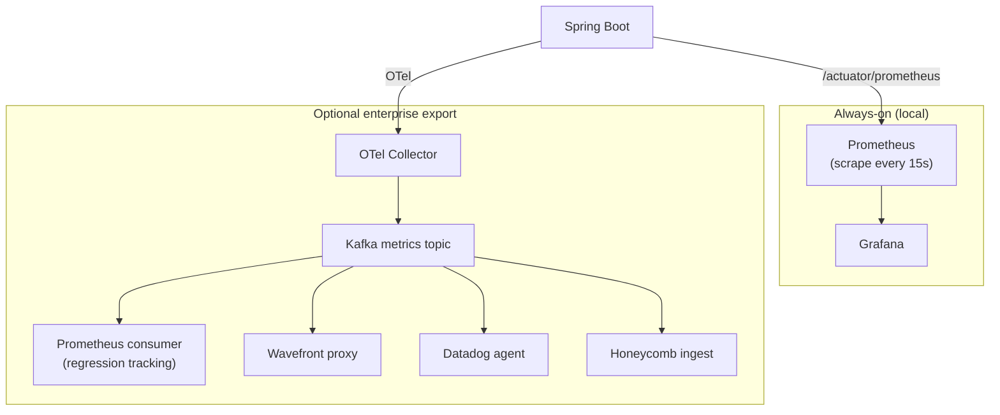

# Blissful Infra — Observability & Metric Regression Tracking Specification

## Vision

Enterprise-grade observability on your laptop. Every blissful-infra project ships with a full local observability stack that mirrors what engineering teams run in production — Prometheus, Grafana, Jaeger and Loki, pre-wired and provisioned with zero configuration.

For teams that use enterprise APM tools (Wavefront, Datadog, Honeycomb, Dynatrace), blissful-infra provides an optional Kafka-based export path that pipes metrics to any backend without changing application code. The local Prometheus/Grafana stack is always primary — the enterprise export is additive, never a replacement.

---

## Current State

The following is already shipped and working:

```
Spring Boot → /actuator/prometheus → Prometheus (scrape every 15s) → Grafana
Spring Boot → OTel Java agent → Jaeger (traces)
All containers → Promtail → Loki (logs)
Deployment tracking → P95 latency delta captured on every deploy
```

Grafana has pre-provisioned dashboards for JVM heap, HTTP request rate, error rate and latency percentiles. Jaeger receives traces from every HTTP request and Kafka message automatically via the OTel agent — no instrumentation code required.

---

## Architecture: Primary + Optional Export

The core design principle: **Prometheus/Grafana is always on and never depends on Kafka**. The Kafka export path is opt-in for clients who want to pipe metrics to an enterprise backend.



If Kafka goes down, the primary observability path is unaffected. The export path degrades gracefully — metrics buffer in the OTel collector and flush when Kafka recovers, up to a configurable retention limit.

---

## Metric Regression Tracking

### Problem

Prometheus and Grafana show you what metrics look like right now. They don't tell you which commit caused latency to increase, or which domain (auth, payments, messaging) degraded after a deploy. Teams using Datadog or Wavefront solve this with commit-annotated metric graphs and APM-level attribution. blissful-infra should provide the same locally, for free.

### Design

Every deployment creates a **metric snapshot** — a point-in-time capture of key metrics tagged with the git SHA, branch and timestamp. The regression engine compares the current snapshot against the previous N snapshots and flags regressions.

#### Metric snapshot schema

```typescript
{
  deploymentId: string       // links to deployment record
  gitSha: string             // commit that triggered the deploy
  branch: string
  timestamp: string          // ISO 8601
  domain: string             // e.g. "auth", "payments", "api" — derived from span tags
  metrics: {
    p50LatencyMs: number
    p95LatencyMs: number
    p99LatencyMs: number
    errorRatePercent: number
    requestsPerSecond: number
    jvmHeapUsedMb?: number
    kafkaConsumerLagMs?: number
  }
}
```

#### Domain attribution

Domains are derived from OpenTelemetry span tags. The Spring Boot template emits spans tagged with the controller package name by default. Custom domain tags can be added via `@Tag("domain", "payments")` on controllers or service classes.

```kotlin
// Auto-tagged by OTel agent from package structure:
// com.blissful.controller.auth → domain: "auth"
// com.blissful.controller.payments → domain: "payments"

// Or explicitly:
@Tag("domain", "checkout")
@RestController
class CheckoutController { ... }
```

#### Regression detection

A regression is flagged when any metric degrades beyond a configurable threshold compared to the rolling baseline (average of previous 5 snapshots):

| Metric | Default regression threshold |
|---|---|
| P95 latency | +20% |
| P99 latency | +30% |
| Error rate | +5 percentage points |
| Kafka consumer lag | +50% |

Regressions are:
- Surfaced in the dashboard deployment history as a red badge
- Logged to the deployment record (visible via `blissful-infra status`)
- Optionally fail the Jenkins CI gate (configurable per project in `blissful-infra.yaml`)

Improvements (metrics better than baseline by the same thresholds) are surfaced as green badges — the system tracks wins as well as regressions.

---

## Pluggable Observability Backend

For teams using enterprise APM tools, the Kafka export path acts as an adapter layer. The application emits OTel spans — the backend consumer is swappable without touching application code.

### Configuration in blissful-infra.yaml

```yaml
observability:
  primary: prometheus          # always-on local stack, never disabled
  export:
    enabled: true
    backend: wavefront          # wavefront | datadog | honeycomb | custom
    wavefront:
      proxyHost: wavefront-proxy.internal
      proxyPort: 2878
      source: blissful-infra-local
```

### Supported export backends (Phase 8+)

| Backend | Transport | Notes |
|---|---|---|
| **Wavefront** | Wavefront proxy → Kafka consumer | WQL-compatible metric naming |
| **Datadog** | Datadog agent → Kafka consumer | DogStatsD format |
| **Honeycomb** | OTLP HTTP → Kafka consumer | Native OTel, simplest to wire |
| **Custom** | Configurable consumer class | Implement `MetricsConsumer` interface |

### Metric naming convention

Metrics are emitted using OpenTelemetry semantic conventions to ensure compatibility across backends. No backend-specific naming in application code.

---

## Kafka Topic Design

Three topics for the observability pipeline:

| Topic | Content | Retention |
|---|---|---|
| `o11y.metrics` | OTel metric data points (counters, gauges, histograms) | 24 hours |
| `o11y.spans` | OTel trace spans | 24 hours |
| `o11y.snapshots` | Deployment metric snapshots (for regression tracking) | 90 days |

`o11y.snapshots` has long retention because regression tracking needs historical data across many deploys.

---

## Dashboard Integration

The existing dashboard at `localhost:3002` gains two new views:

### Metric timeline view
- Time-series graph of P95 latency and error rate across the last N deployments
- Vertical markers at each deployment, labeled with git SHA (short) and branch
- Click a marker to see the full deployment record and regression report
- Domain selector — filter to a specific domain (auth, payments, etc.)

### Regression report
- Per-deployment comparison table: metric before, metric after, delta, threshold status
- Domain breakdown — which domains regressed, which improved
- Link to the Jaeger trace that best illustrates the regression (highest latency span in the window)

---

## Implementation Phases

### Phase 8a — Metric snapshots (no Kafka required)
- Capture metric snapshot from Prometheus at deploy time (post-deploy hook in Jenkins pipeline)
- Store snapshots as JSONL alongside deployment records
- Regression detection against rolling baseline
- Dashboard: deployment history badges (red/green) + basic regression report

### Phase 8b — Domain attribution
- OTel span tag convention for domain labeling
- Update Spring Boot template to auto-tag by controller package
- Regression report broken down by domain

### Phase 8c — Kafka export path
- OTel Collector added as optional Docker service
- `o11y.metrics` and `o11y.spans` Kafka topics
- Prometheus consumer (regression tracking backend)
- Dashboard metric timeline view with deployment markers

### Phase 8d — Pluggable backends
- Wavefront consumer (first enterprise target)
- `observability.export` config in `blissful-infra.yaml`
- Documentation: porting from Prometheus/Grafana to Wavefront

---

## Key Design Decisions

- **Prometheus/Grafana is never a dependency of Kafka** — local observability works regardless of Kafka health
- **OTel as the instrumentation standard** — backend-agnostic by design, no vendor lock-in in application code
- **Kafka as transport, not storage** — short retention on metric topics, long retention only on snapshots
- **Regression tracking before pluggable backends** — Phase 8a delivers value immediately without any new infrastructure
- **Domain attribution is opt-in** — auto-tagging from package structure works for most projects, explicit tags for teams with complex domain boundaries
