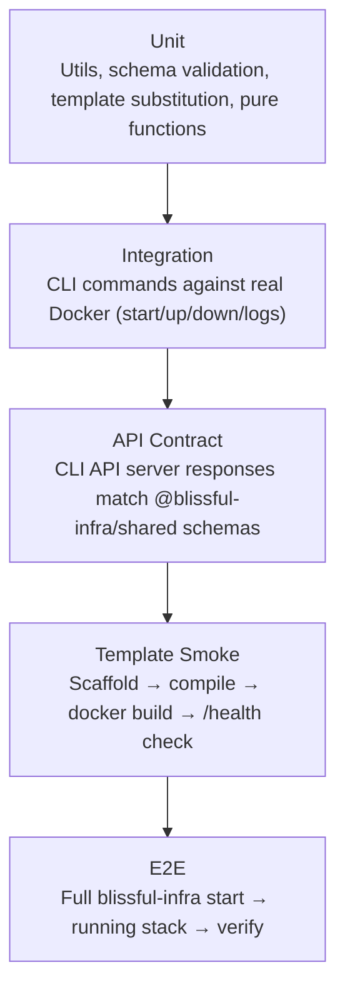

# Testing Strategy

## Philosophy

Tests in blissful-infra serve two distinct purposes that require different approaches:

1. **Platform tests** — tests for the CLI, API server, dashboard, and shared schemas (the `packages/` code we own and ship)
2. **Template tests** — tests that verify each scaffold template produces a working, correct application

The platform is TypeScript running on Node. The templates generate applications in Kotlin, Python, Go, and TypeScript. These require entirely different test tooling and strategies.

**Current state:** No automated test suite exists. This document defines the target state and the order in which to build toward it.

---

## Test Pyramid



More unit tests than integration tests, more integration than E2E. Template smoke tests are a separate lane — they run less frequently and require more infrastructure.

---

## Layer 1: Unit Tests

**Location:** `packages/*/src/**/*.test.ts`
**Runner:** Vitest (native ESM support, fast, good TypeScript integration)
**Coverage tool:** `@vitest/coverage-v8`
**Coverage target:** ≥ 80% line coverage on `packages/cli/src/utils/` and `packages/shared/src/`

### packages/shared — Schema Tests

Every Zod schema should have tests that verify:
- Valid inputs parse correctly (`safeParse` returns `success: true`)
- Invalid inputs are rejected with meaningful error messages
- Optional fields behave correctly when absent
- Inferred TypeScript types match expected shapes (compile-time)

```ts
// Example: packages/shared/src/schemas/deployments.test.ts
describe("DeploymentRecordSchema", () => {
  it("parses a valid record", () => {
    const result = DeploymentRecordSchema.safeParse({
      id: "deploy-1234",
      timestamp: Date.now(),
      projectName: "my-app",
      gitSha: "abc1234",
      status: "success",
      regression: false,
    });
    expect(result.success).toBe(true);
  });

  it("rejects unknown status values", () => {
    const result = DeploymentRecordSchema.safeParse({ ...validRecord, status: "pending" });
    expect(result.success).toBe(false);
  });

  it("accepts optional latency fields when absent", () => { ... });
});
```

Priority order for schema tests: `deployments` > `config` > `api` > `metrics` > `alerts`

### packages/cli — Utils Tests

Highest-value targets in `packages/cli/src/utils/`:

| File | What to test |
|---|---|
| `template.ts` | `{{VAR}}` substitution, `{{#IF_X}}` conditional blocks, nested edge cases |
| `config.ts` | YAML parsing (valid config, missing fields, malformed YAML), `parsePluginSpecs` |
| `deployment-storage.ts` | `saveDeployment` / `loadDeployments` round-trip, `updateDeployment` found/not-found, malformed JSONL line is skipped |
| `plugin-registry.ts` | Registry lookups by type, unknown type handling |
| `alerts.ts` | Alert threshold evaluation logic (is value > threshold?) |
| `metrics-storage.ts` | JSONL round-trip, time-range filtering |

These are pure-ish functions with file I/O — use a temp directory (`os.tmpdir()` + unique suffix) for tests that write files. No Docker required.

### packages/dashboard — Component Tests

Vitest + `@testing-library/react`. Test the data transformation and display logic, not the full render tree.

Priority targets:
- Deployment row: renders correct status badge, latency delta color, Jaeger link
- Metrics chart: handles empty data gracefully, renders with mocked Recharts
- Type safety: TypeScript compilation with shared schema types is test enough for most UI shapes

---

## Layer 2: Integration Tests

**Location:** `packages/cli/src/__tests__/integration/`
**Runner:** Vitest with increased timeout (`testTimeout: 60_000`)
**Requirement:** Docker must be running. Tests are skipped if Docker is unavailable.

### CLI Command Tests

Test the actual CLI commands against a real (temporary) Docker environment.

**Setup pattern:**
```ts
// Each test suite gets an isolated temp directory and project name
beforeAll(async () => {
  tempDir = await fs.mkdtemp(path.join(os.tmpdir(), "blissful-test-"));
  projectName = `test-${Date.now()}`;
});

afterAll(async () => {
  // Always clean up — bring down containers, delete temp dir
  await execa("blissful-infra", ["down"], { cwd: path.join(tempDir, projectName) });
  await fs.rm(tempDir, { recursive: true, force: true });
});
```

**Test cases:**

```ts
describe("blissful-infra start", () => {
  it("scaffolds a project directory", async () => {
    await execa("blissful-infra", ["start", projectName, "--no-open"], { cwd: tempDir });
    const files = await fs.readdir(path.join(tempDir, projectName));
    expect(files).toContain("docker-compose.yaml");
    expect(files).toContain("blissful-infra.yaml");
    expect(files).toContain("backend");
    expect(files).toContain("frontend");
  });

  it("boots services that respond to health checks", async () => {
    // After start, backend should be reachable
    const response = await fetch("http://localhost:8080/actuator/health");
    expect(response.status).toBe(200);
  });
});

describe("blissful-infra down / up cycle", () => {
  it("stops and restarts without data loss", async () => { ... });
});

describe("blissful-infra logs", () => {
  it("returns output without error", async () => { ... });
});
```

### API Server Tests

Test the Express API server (`packages/cli/src/server/api.ts`) in isolation — start the server against a test project directory, make real HTTP requests, assert responses match `@blissful-infra/shared` schemas.

```ts
describe("GET /api/projects", () => {
  it("response matches ProjectsListResponseSchema", async () => {
    const res = await fetch("http://localhost:3002/api/projects");
    const body = await res.json();
    const parsed = ProjectsListResponseSchema.safeParse(body);
    expect(parsed.success).toBe(true);
  });
});

describe("POST /api/projects/:name/deployments", () => {
  it("rejects missing gitSha with 400", async () => {
    const res = await fetch(`http://localhost:3002/api/projects/${projectName}/deployments`, {
      method: "POST",
      headers: { "Content-Type": "application/json" },
      body: JSON.stringify({ status: "running" }), // no gitSha
    });
    expect(res.status).toBe(400);
    const body = await res.json();
    expect(body.error).toBeDefined();
  });

  it("creates a deployment record and returns it", async () => {
    const res = await fetch(..., { body: JSON.stringify({ gitSha: "abc1234" }) });
    const body = await res.json();
    const parsed = DeploymentRecordSchema.safeParse(body);
    expect(parsed.success).toBe(true);
  });
});
```

**Contract testing principle:** Every API response must parse against its corresponding schema from `@blissful-infra/shared`. If it doesn't, both the test and the schema should be updated together — they are the contract.

---

## Layer 3: Template Smoke Tests

**Location:** `packages/cli/src/__tests__/templates/`
**Runner:** Vitest with long timeouts (`testTimeout: 300_000` — 5 minutes)
**CI:** Run nightly or on PR to `main`, not on every commit (too slow)

### What a smoke test verifies

For each template (`spring-boot`, `fastapi`, `express`, `go-chi`, `react-vite`):

```
1. Scaffold            → `blissful-infra start test-{template} --backend {template}`
2. Image builds        → `docker compose build` exits 0
3. Stack boots         → `docker compose up -d` exits 0, containers reach "healthy"
4. Health check        → GET /actuator/health (or /health) returns 200
5. Standard endpoints  → GET /hello returns 200, POST /echo round-trips body
6. Shutdown            → `docker compose down` exits 0, no orphan containers
```

### Template smoke test matrix

| Template | Health endpoint | Test runner (internal) |
|---|---|---|
| `spring-boot` | `/actuator/health` | `./gradlew test` |
| `fastapi` | `/health` | `pytest` |
| `express` | `/health` | `npm test` |
| `go-chi` | `/health` | `go test ./...` |
| `react-vite` | nginx `/` → 200 | Vitest |

The internal test runner step (`./gradlew test`, `pytest`, etc.) is optional in smoke tests — it's covered more thoroughly in each template's own CI pipeline. Smoke tests focus on "does it boot and respond correctly."

### Database variant matrix

Each template should be smoke-tested with at least two database configs:
- `--database none`
- `--database postgres`

The `postgres-redis` variant is tested less frequently (weekly) due to resource cost.

---

## Layer 4: API Contract Tests

**Separate from integration tests.** These tests exist specifically to catch drift between what the API server produces and what `@blissful-infra/shared` declares.

**When to run:** On every commit that touches `packages/cli/src/server/api.ts` or `packages/shared/src/schemas/api.ts`.

**Strategy:** The TypeScript compiler catches most drift at compile time (since `api.ts` now imports shared types). Contract tests add a runtime layer — the actual JSON serialized and deserialized over HTTP must match.

Approach: Record → Assert
1. Start the API server against a fixture project
2. Call each endpoint
3. Assert `Schema.safeParse(responseBody).success === true` for every route
4. Any schema violation fails the test — update the schema or the endpoint, never the test

---

## Layer 5: End-to-End Tests

**Location:** `e2e/`
**Runner:** Playwright (for dashboard UI scenarios) + raw fetch/curl (for API flows)
**When:** Pre-release gate only (not in PR CI)

### Scenarios

**Full CLI flow:**
```
1. npm install -g @blissful-infra/cli (from local dist)
2. blissful-infra start e2e-test-app
3. Verify dashboard accessible at localhost:3002
4. Verify backend at localhost:8080/actuator/health
5. Verify frontend at localhost:3000
6. Post a deployment record via API
7. Verify it appears in dashboard Deployments tab
8. blissful-infra down
9. Verify all containers stopped
```

**Dashboard UI (Playwright):**
```
1. Navigate to localhost:3002
2. Assert project appears in list
3. Click Logs tab → assert log entries visible
4. Click Deployments tab → assert deployment row visible
5. Assert no console errors
```

---

## Test Infrastructure Setup

### Vitest config (`vitest.config.ts` at repo root)

```ts
import { defineConfig } from "vitest/config";

export default defineConfig({
  test: {
    projects: [
      "packages/shared",
      "packages/cli",
      "packages/dashboard",
    ],
    coverage: {
      provider: "v8",
      reporter: ["text", "lcov"],
      thresholds: {
        lines: 80,
        functions: 80,
      },
      include: [
        "packages/shared/src/**",
        "packages/cli/src/utils/**",
      ],
    },
  },
});
```

Each package gets its own `vitest.config.ts` for package-level runs:
```ts
// packages/shared/vitest.config.ts
export default defineConfig({
  test: {
    include: ["src/**/*.test.ts"],
    environment: "node",
  },
});
```

### npm scripts

```json
// root package.json
"test": "vitest run",
"test:watch": "vitest",
"test:coverage": "vitest run --coverage",
"test:integration": "vitest run --project packages/cli --testPathPattern integration",
"test:templates": "vitest run --project packages/cli --testPathPattern templates",
"test:contract": "vitest run --project packages/cli --testPathPattern contract"
```

### CI matrix

| Trigger | Tests run |
|---|---|
| Every commit / PR | Unit tests + schema tests + API contract tests |
| PR to `main` | + Integration tests (requires Docker) |
| Nightly | + Template smoke tests (all templates × database variants) |
| Pre-release | + E2E tests |

### Test environment requirements

Tests that require Docker should check for it and skip gracefully:

```ts
const dockerAvailable = await execa("docker", ["info"]).then(() => true).catch(() => false);
const describeWithDocker = dockerAvailable ? describe : describe.skip;

describeWithDocker("CLI integration tests", () => { ... });
```

This keeps the unit test suite runnable in any environment (including CI runners without Docker daemon access).

---

## Implementation Order

Following the principle of maximum impact first:

1. **`packages/shared` schema tests** — no infrastructure required, immediately validates the contract layer
2. **`packages/cli/src/utils/template.ts` unit tests** — pure function, critical path for all scaffolding
3. **`packages/cli/src/utils/config.ts` unit tests** — YAML parsing, used by every command
4. **`packages/cli/src/utils/deployment-storage.ts` unit tests** — file I/O with temp dir
5. **API contract tests** — start server, assert schema compliance for every route
6. **`start` command integration test** — scaffold a project, verify directory structure (no Docker needed)
7. **Template smoke tests: spring-boot** — first template, proves the smoke test pattern works
8. **Template smoke tests: remaining templates** — fill out the matrix
9. **Dashboard component tests** — Vitest + testing-library for critical rendering logic
10. **E2E tests** — pre-release gate, after everything else is in place

---

## What Good Tests Look Like Here

**Do:**
- Test behavior, not implementation. Test that `loadDeployments` returns records newest-first, not that it calls `sort`.
- Use `safeParse` assertions in API tests — they produce readable failure messages that identify which field is wrong.
- Clean up after yourself. Any test that creates files, starts containers, or binds ports must clean them up in `afterAll`, even on failure.
- Test the unhappy path. The Jenkinsfile sends malformed JSON — test that the API handles it gracefully.

**Don't:**
- Mock Docker, `execa`, or the API server in integration tests. The whole point of an integration test is to catch the wiring.
- Write tests for generated template code (that's what the template smoke tests cover).
- Assert on specific log message strings — they change too often. Assert on structure and status codes.
- Leave test projects running if a test fails — use `afterAll` with `try/finally`.
